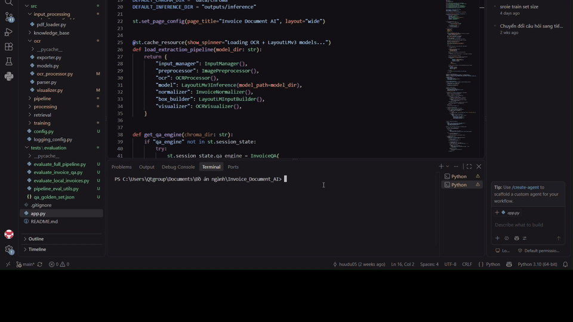

# Invoice Document AI

Hệ thống AI phân tích và tra cứu thông minh hóa đơn doanh nghiệp, kết hợp OCR, Document AI, LayoutLMv3, Semantic Retrieval, ChromaDB và Large Language Models (LLMs).

## Giới thiệu

Đồ án xây dựng một hệ thống tự động phân tích hóa đơn từ các tài liệu PDF hoặc hình ảnh, trích xuất những thông tin quan trọng và hỗ trợ người dùng tra cứu dữ liệu hóa đơn bằng ngôn ngữ tự nhiên.

Hệ thống kết hợp **OCR, Document Understanding, Semantic Retrieval và Large Language Model** để chuyển đổi hóa đơn từ dữ liệu hình ảnh ban đầu thành dữ liệu có cấu trúc và có khả năng tìm kiếm.

Các thông tin chính được trích xuất gồm:

- Tên công ty
- Ngày hóa đơn
- Địa chỉ
- Tổng tiền


---

## Demo

### Video Demonstration

<p align="center">
  
  <br>
  <i>Demo hệ thống Invoice Document AI</i>
</p>

Video minh họa toàn bộ quá trình xử lý hóa đơn, từ khi đưa tài liệu đầu vào, nhận dạng và trích xuất thông tin bằng OCR và LayoutLMv3, đến khi người dùng đặt câu hỏi và nhận được câu trả lời từ hệ thống.

---

## Dataset

Mô hình Document Understanding trong project được fine-tune trên **SROIE (Scanned Receipts OCR and Information Extraction)** dataset.

SROIE là dataset được xây dựng cho bài toán OCR và trích xuất thông tin quan trọng từ hình ảnh hóa đơn/biên lai. Dataset cung cấp hình ảnh cùng annotation cho các trường thông tin chính như:

- Company
- Date
- Address
- Total

Dataset được sử dụng để fine-tune mô hình **LayoutLMv3** cho bài toán trích xuất thông tin từ hóa đơn.

Dataset: https://rrc.cvc.uab.es/?ch=13

---

## Công nghệ sử dụng

* Python
* PyTorch
* PaddleOCR
* LayoutLMv3
* ChromaDB
* Large Language Models (LLMs)
* OpenCV
* pdf2image

---

## Pipeline

```text
Hóa đơn PDF / Image
        ↓
Tiền xử lý ảnh
        ↓
PaddleOCR
        ↓
Fine-tuned LayoutLMv3
        ↓
Trích xuất thông tin
        ↓
Chuẩn hóa dữ liệu
        ↓
ChromaDB
        ↓
Semantic Retrieval
        ↓
LLM
        ↓
Câu trả lời bằng ngôn ngữ tự nhiên