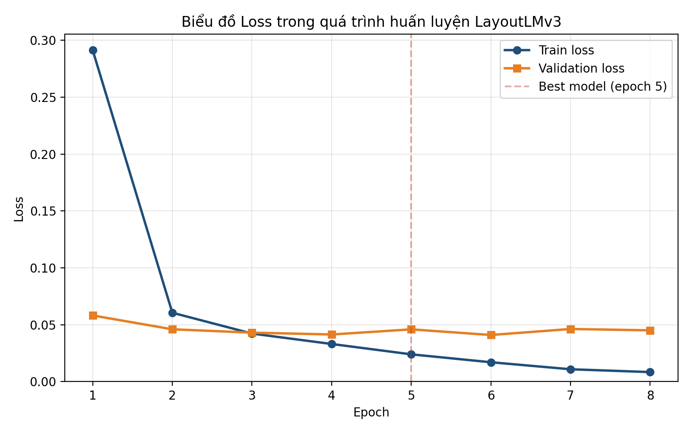
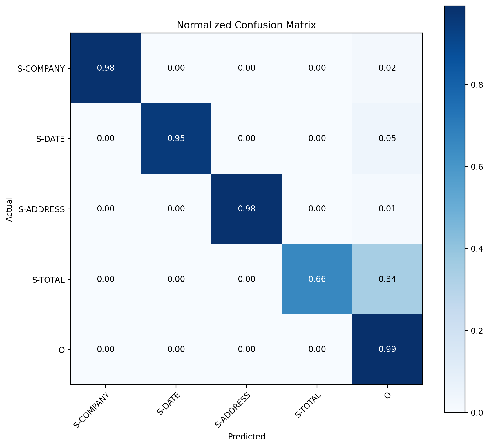

# Invoice Document AI

Hệ thống AI phân tích và tra cứu thông minh hóa đơn doanh nghiệp, kết hợp OCR, Document AI (LayoutLMv3), Semantic Retrieval, ChromaDB và Large Language Model theo kiến trúc Retrieval-Augmented Generation (RAG).

## Giới thiệu

Đồ án xây dựng một hệ thống tự động phân tích hóa đơn từ tài liệu PDF hoặc hình ảnh, trích xuất những thông tin quan trọng và hỗ trợ người dùng tra cứu dữ liệu hóa đơn bằng ngôn ngữ tự nhiên.

Hệ thống kết hợp **OCR, Document Understanding, Semantic Retrieval và Large Language Model** để chuyển đổi hóa đơn từ dữ liệu hình ảnh ban đầu thành dữ liệu có cấu trúc, có khả năng tìm kiếm và trả lời câu hỏi.

Các thông tin chính được trích xuất gồm:

- Tên công ty (Company)
- Ngày hóa đơn (Date)
- Địa chỉ (Address)
- Tổng tiền (Total)

---

## Demo

<p align="center">
  
  <br>
  <i>Demo hệ thống Invoice Document AI</i>
</p>

Video minh họa toàn bộ quá trình xử lý hóa đơn, từ khi đưa tài liệu đầu vào, nhận dạng và trích xuất thông tin bằng OCR và LayoutLMv3, đến khi người dùng đặt câu hỏi và nhận được câu trả lời từ hệ thống.

---

## Kiến trúc hệ thống

Hệ thống gồm hai giai đoạn chính:

**Giai đoạn 1 — Xây dựng dữ liệu hóa đơn**

```text
Hóa đơn (PDF / PNG / JPG)
        ↓
Kiểm tra & tiền xử lý ảnh
        ↓
OCR (PaddleOCR)
        ↓
Trích xuất thông tin (LayoutLMv3 fine-tuned)
        ↓
Chuẩn hóa dữ liệu (company, date, address, total)
        ↓
Lưu trữ vector (ChromaDB)
```

**Giai đoạn 2 — Xử lý câu hỏi**

```text
        Câu hỏi người dùng (ngôn ngữ tự nhiên)
                        ↓
        Phân tích truy vấn (query processing, intent)
                        ↓
   ┌────────────────────┴────────────────────┐
   ↓                                         ↓
Semantic Retrieval                    Invoice Analytics
(re-ranking hóa đơn liên quan)        (tính tổng, đếm, so sánh)
   └────────────────────┬────────────────────┘
                        ↓
              LLM sinh câu trả lời
                        ↓
              Câu trả lời bằng ngôn ngữ tự nhiên
```

---

## Dataset

Mô hình Document Understanding trong dự án được fine-tune trên **SROIE (Scanned Receipts OCR and Information Extraction)** — bộ dữ liệu công khai từ cuộc thi ICDAR 2019, xây dựng cho bài toán OCR và trích xuất thông tin quan trọng từ hình ảnh hóa đơn/biên lai.

Dataset cung cấp hình ảnh cùng annotation cho bốn trường thông tin chính:

- Company
- Date
- Address
- Total

Dataset gốc: https://rrc.cvc.uab.es/?ch=13
Phiên bản HuggingFace sử dụng trong dự án: [`mp-02/sroie`](https://huggingface.co/datasets/mp-02/sroie)

---

## Cài đặt

### Yêu cầu hệ thống

- Python 3.10 
- [Poppler](https://poppler.freedesktop.org/) (bắt buộc cho `pdf2image` khi đọc file PDF)
  - Windows: tải bản build tại [oschwartz10612/poppler-windows](https://github.com/oschwartz10612/poppler-windows/releases), giải nén và ghi lại đường dẫn thư mục `bin`
  - macOS: `brew install poppler`
  - Ubuntu/Debian: `sudo apt install poppler-utils`
- GPU (khuyến nghị) với CUDA nếu muốn fine-tune hoặc chạy inference LayoutLMv3 nhanh hơn; CPU vẫn chạy được nhưng chậm hơn đáng kể
- API key của Gemini (hoặc LLM tương thích OpenAI API khác) nếu sử dụng bước sinh câu trả lời

### 1. Clone dự án

```bash
git clone https://github.com/huudu05/Invoice_Document_AI.git
cd invoice-document-ai
```

### 2. Cài đặt thư viện

```bash
pip install -r requirements.txt
```

`requirements.txt` tối thiểu cần có:

```text
torch==2.8.0
torchvision==0.23.0
transformers==5.15.0
datasets==4.0.0
safetensors==0.8.0
paddleocr==2.10.0
paddlepaddle==2.6.2
chromadb==1.5.9
pillow==12.3.0
opencv-python==5.0.0.93
pdf2image==1.17.0
openai==2.52.0
scikit-learn==1.7.2
matplotlib==3.10.9
pandas==2.3.3
streamlit==1.62.0
tqdm==4.70.0
```

### 3. Cấu hình

Hai cấu hình cần thiết lập trước khi chạy:

- **GEMINI_API_KEY**: khai báo trực tiếp làm biến môi trường hệ thống, ví dụ:
```bash
  # macOS / Linux
  export GEMINI_API_KEY=your_api_key_here

  # Windows (PowerShell)
  setx GEMINI_API_KEY "your_api_key_here"
```
- **Đường dẫn Poppler**: chỉnh sửa trực tiếp trong `src/config.py`, thay giá trị mặc định bằng đường dẫn thư mục `bin` của Poppler trên máy bạn.

---

## Hướng dẫn sử dụng

### 1. Chuẩn bị dữ liệu

Đặt hóa đơn cần xử lý (PDF hoặc ảnh) vào thư mục `data/raw/`.

### 2. Fine-tune LayoutLMv3 trên SROIE (nếu chưa có model)

```bash
python -m src.training.train_layoutlm
```

Model tốt nhất được lưu tại `models/layoutlmv3/best_model` (hoặc đường dẫn tương ứng cấu hình trong script), kèm lịch sử huấn luyện tại `outputs/training/training_history.json`.

### 3. Đánh giá model trên tập test

```bash
python -m src.training.evaluate_layoutlmv3
```

### 4. Nạp hóa đơn vào ChromaDB

```bash
python -m src.knowledge_base.index_invoice
```

### 5. Chạy pipeline hỏi đáp

```bash
python -m src.pipeline.test_invoice_qa
```

### 6. Chạy giao diện người dùng (nếu sử dụng Streamlit)

```bash
python -m streamlit run app.py
```

---

## Kết quả

Chi tiết số liệu huấn luyện, đánh giá end-to-end và kiểm thử hệ thống.
**Loss trong quá trình huấn luyện**

<p align="center">
  
</p>

**Confusion Matrix (normalized) trên tập test SROIE**

<p align="center">
  
</p>

---
